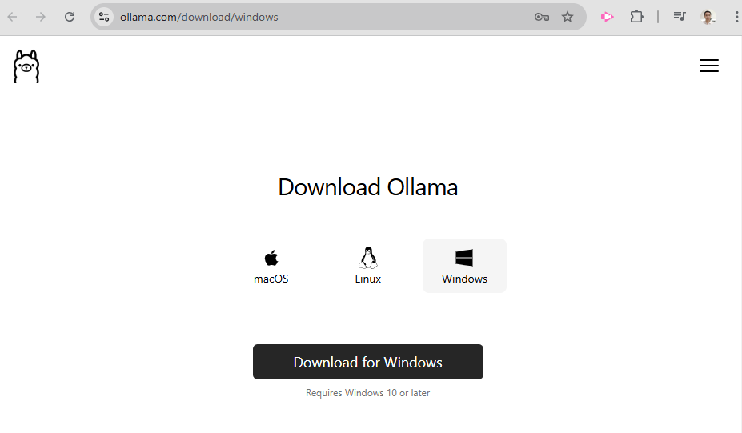
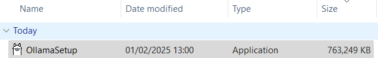
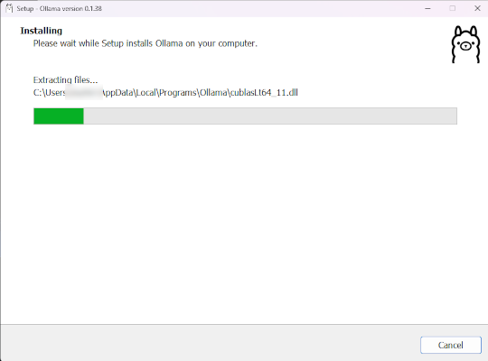
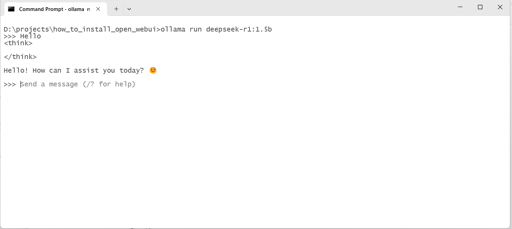

# 1. Setup Ollama 

Install ollama with download Ollama and install

Download and install Ollama via link

https://ollama.com/download/windows



Install by double click OllamaSetup.exe






load model by command

```bash
ollama run deepseek-r1:1.5b
```

Test Ask question


