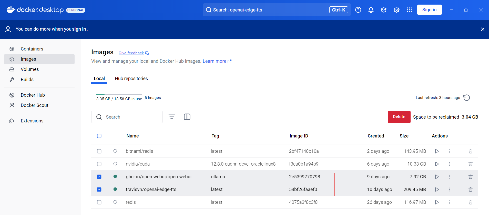
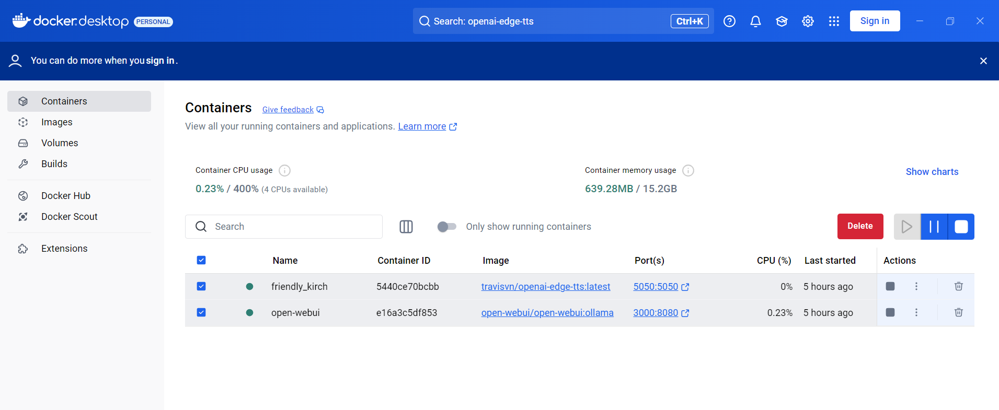

# * 2. Setup Open WebUI   and OpenAI-Edge-TTS

After install docker desktop

Open command prompt  to download  image

```bash
docker pull ghcr.io/open-webui/open-webui:ollama
docker pull travisvn/openai-edge-tts:latest

```



Start TTS Server  (Text to speech server)  with config Thai Language

```bash
# install tts  with default voice Thai
docker run -d -p 5050:5050 ^
  -e API_KEY=your_api_key_here ^
  -e PORT=5050 ^
  -e DEFAULT_VOICE=th-TH-NiwatNeural ^
  -e DEFAULT_RESPONSE_FORMAT=mp3 ^
  -e DEFAULT_SPEED=1.0 ^
  -e DEFAULT_LANGUAGE=th-TH ^
  -e REQUIRE_API_KEY=True ^
  -e REMOVE_FILTER=False ^
  -e EXPAND_API=True ^
  travisvn/openai-edge-tts:latest


# install tts with enlish voice
docker run -d -p 5050:5050 ^
  -e API_KEY=your_api_key_here ^
  -e PORT=5050 ^
  -e DEFAULT_VOICE=en-US-AvaNeural ^
  -e DEFAULT_RESPONSE_FORMAT=mp3 ^
  -e DEFAULT_SPEED=1.0 ^
  -e DEFAULT_LANGUAGE=en-US ^
  -e REQUIRE_API_KEY=True ^
  -e REMOVE_FILTER=False ^
  -e EXPAND_API=True ^
  travisvn/openai-edge-tts:latest

# install tts with multilanguage
docker run -d -p 5051:5050 ^
  -e API_KEY=your_api_key_here ^
  -e PORT=5050 ^
  -e DEFAULT_VOICE=en-US-EmmaMultilingualNeural ^
  -e DEFAULT_RESPONSE_FORMAT=mp3 ^
  -e DEFAULT_SPEED=1.0 ^
  -e DEFAULT_LANGUAGE=en-US ^
  -e REQUIRE_API_KEY=True ^
  -e REMOVE_FILTER=False ^
  -e EXPAND_API=True ^
  travisvn/openai-edge-tts:latest

# install open-webui
docker run -d -p 3000:8080 --gpus=all -v ollama:/root/.ollama -v open-webui:/app/backend/data --name open-webui --restart always ghcr.io/open-webui/open-webui:ollama

```


