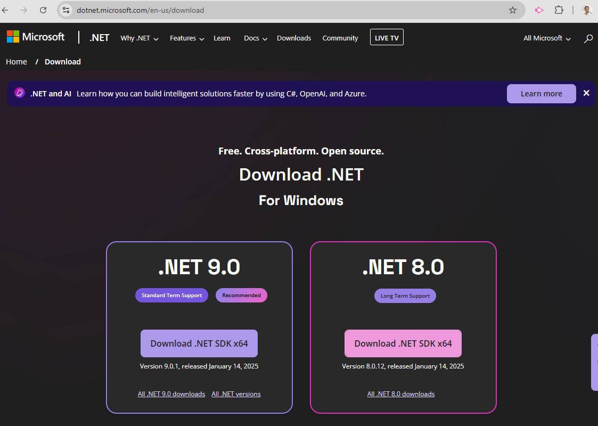

# 5.Generate Selfsign certificate for localhost

using dotnet dev-certs command

```bash
dotnet dev-certs https -ep localhost.crt -np --trust --format pem
```

check file exist  

you need to install dotnet   before run command

[https://dotnet.microsoft.com/en-us/download](https://dotnet.microsoft.com/en-us/download)


