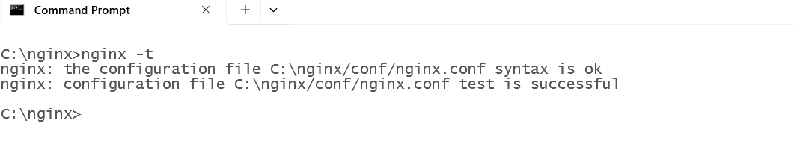
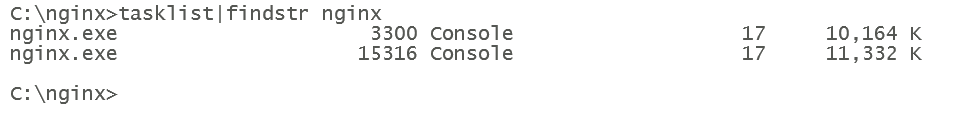
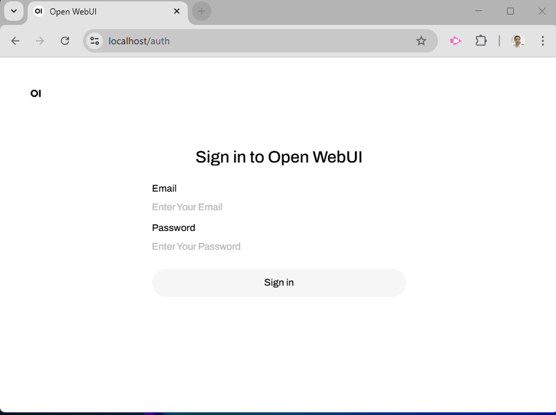

# 5. Config nginx.conf

for Reverse Proxy for HTTPS and open Web UI

open folder c:\nginx\conf

edit file nginx.conf

```nginx

#user  nobody;
worker_processes  1;


events {
    worker_connections  1024;
}


http {
    include       mime.types;
    default_type  application/octet-stream;
    sendfile        on;
    keepalive_timeout  65;

    server {
        listen 80;
        listen 443 ssl;
        # force https-redirects
        if ($scheme = http) {
            return 301 https://$server_name$request_uri;
        } 
        server_name  localhost;   
        ssl_certificate      c:/nginx/cert/localhost.crt;
        ssl_certificate_key  c:/nginx/cert/localhost.key;

        ssl_session_cache    shared:SSL:1m;
        ssl_session_timeout  5m;

        ssl_ciphers  HIGH:!aNULL:!MD5;
        ssl_prefer_server_ciphers  on;
      
        location / {
            proxy_pass http://host.docker.internal:3000;

            # Add WebSocket support (Necessary for version 0.5.0 and up)
            proxy_http_version 1.1;
            proxy_set_header Upgrade $http_upgrade;
            proxy_set_header Connection "upgrade";

            proxy_set_header Host $host;
            proxy_set_header X-Real-IP $remote_addr;
            proxy_set_header X-Forwarded-For $proxy_add_x_forwarded_for;
            proxy_set_header X-Forwarded-Proto $scheme;

            # (Optional) Disable proxy buffering for better streaming response from models
            proxy_buffering off;
        }
    
   }

}

```

test config by command

```bash
nginx -t

```



if systax is ok start  nginx by run start.bat

```bash
start.bat
```

check process by command

```bash
tasklist|findstr nginx
```



Open Web Browse and browse to 

[https://localhost](https://localhost)

and Show Open WebUI logon screen


