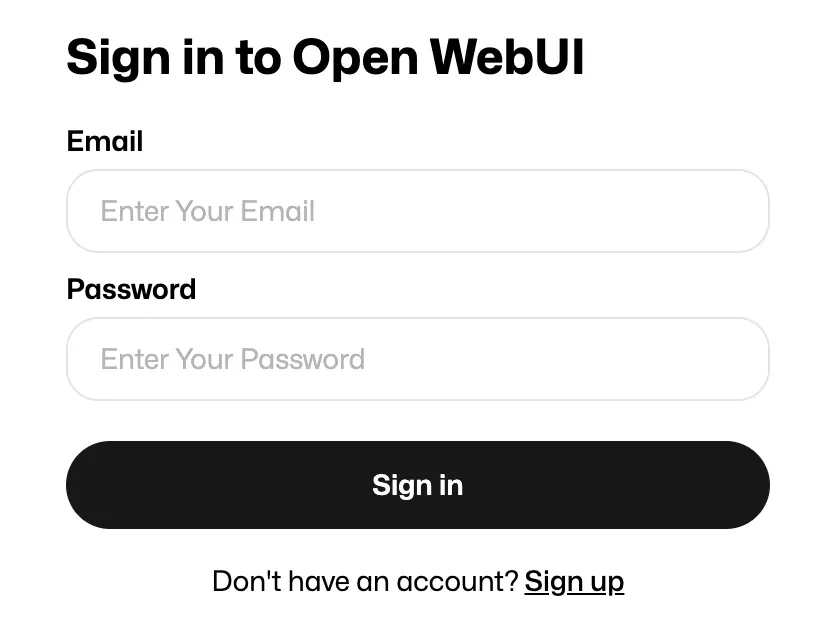
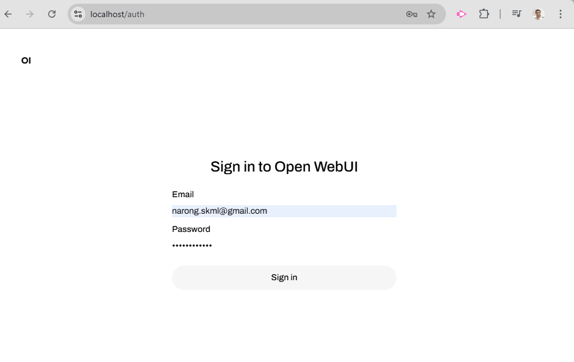
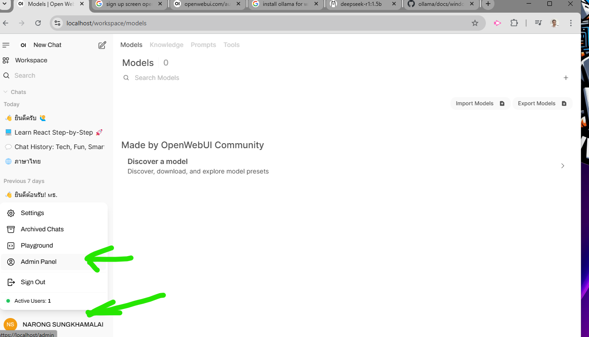
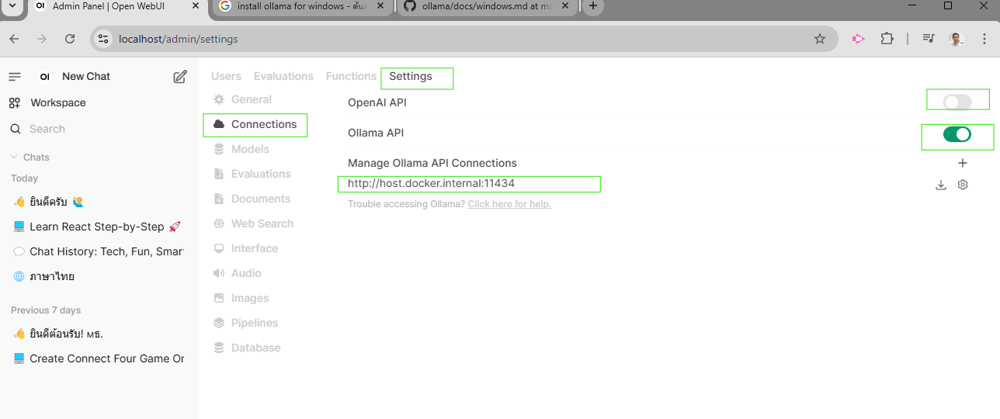

# * 6.Setup and Config Open WebUI

Install ollama with download Ollama and install

Download and install Ollama via link

https://ollama.com/download/windows


Install by double click OllamaSetup.exe


load model by command

```bash
ollama run deepseek-r1:1.5b
```


Open https://localhost

Web display logon/Register screen

enter  email , password for register  as administrator




Login to system 




Click on User  > Admin Panel



Menu Settings > Connections

    Close OpenAI API

    Opend Ollama API

    enter url

```
http://host.docker.internal:11434
```




