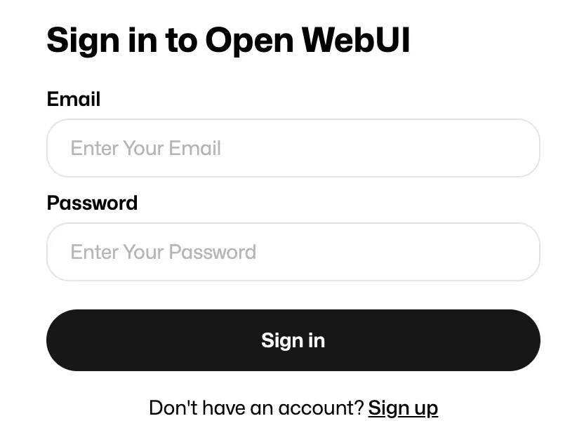
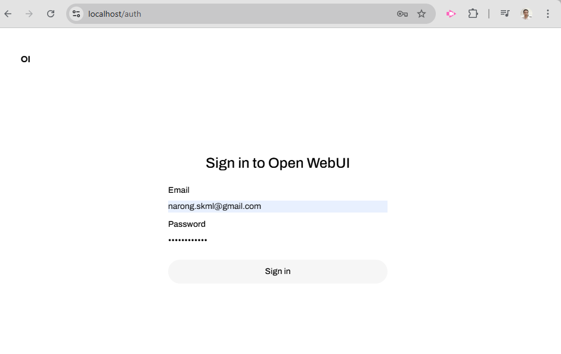
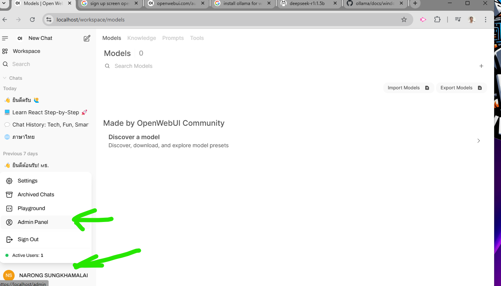
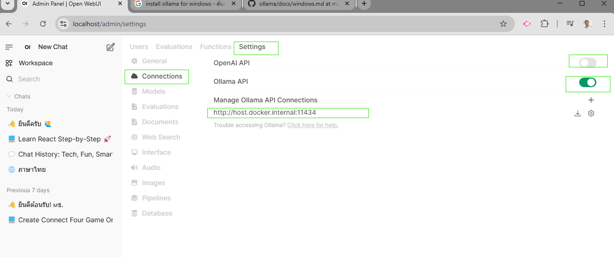
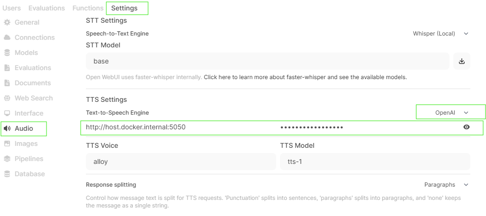

# 7.Config Open WebUI

Open Browser and brows to url    [https://localhost](https://localhost)

Web display logon/Register screen

enter  email , password for register  as administrator



Login to system



Click on User  > Admin Panel



Menu Settings > Connections

    Close OpenAI API

    Opend Ollama API

    enter url

```
http://host.docker.internal:11434
```




