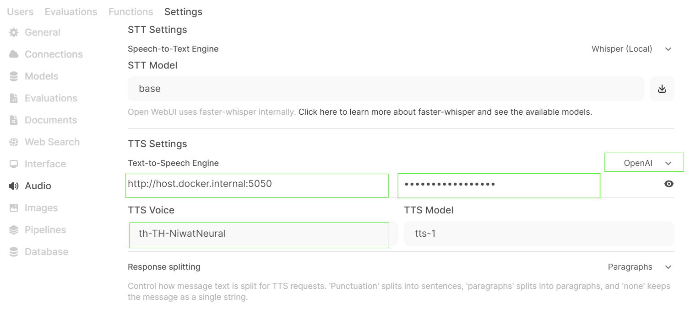

# 7.Config Open WebUI

Open Browser and brows to url    [https://localhost](https://localhost)

Web display logon/Register screen

enter  email , password for register  as administrator


Login to system


Click on User  > Admin Panel


Menu Settings > Connections

    Close OpenAI API

    Opend Ollama API

    enter url

```
## Ollama
http://host.docker.internal:11434
```


```
## TTS
http://host.docker.internal:5050

## TTS Voice
th-TH-NiwatNeural
```




User Setting


Settings > Audio

    Set Voice :  th-TH-NiwatNeural


