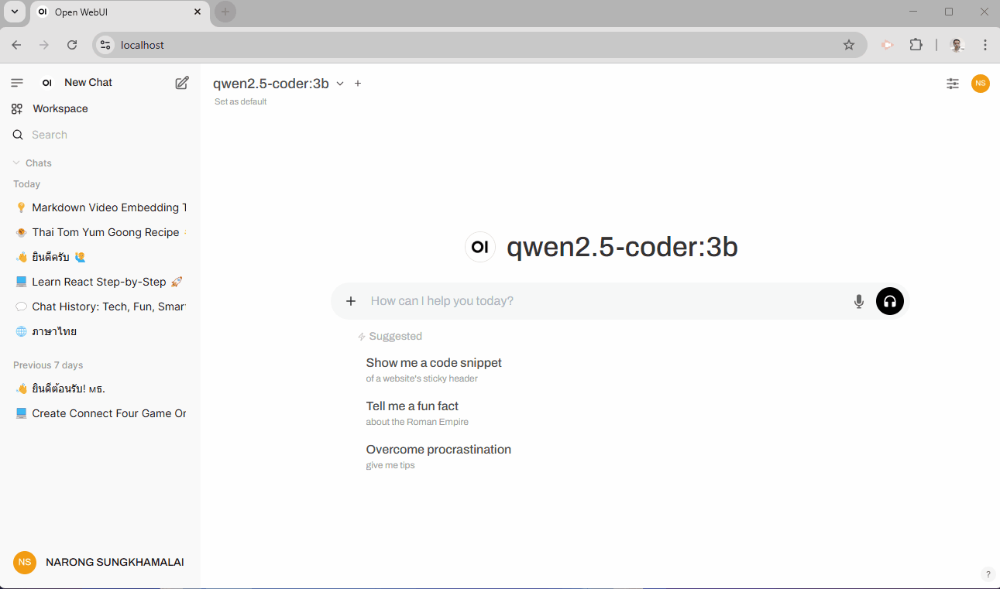

# Step by Step Setup Open Web-UI with Docker on Windows

- open-webui
- openai-edge-tss
- nginx
- generate ssl for https

**Step by Step Click Link Below**

1. [Setup Docker Desktop](1.setup_docker_desktop.md)
2. [docker pull image , run docker openai-edge-tts,  docker open-webui](2.setup_openwebui_openai-edge-tss.md)
3. [install nginx](install_nginx.md)
4. [generate selfsign cert for localhost](4.generate_selfsign_cert.md)
5. [setup nginx config file](5.setup_nginx_config.md)
6. [Signup and config Open WebUI](6.signup_config_open_webui.md)
7. [using Open WebUI](7.ready_to_using_ai.md)

Using Open Web-UI

