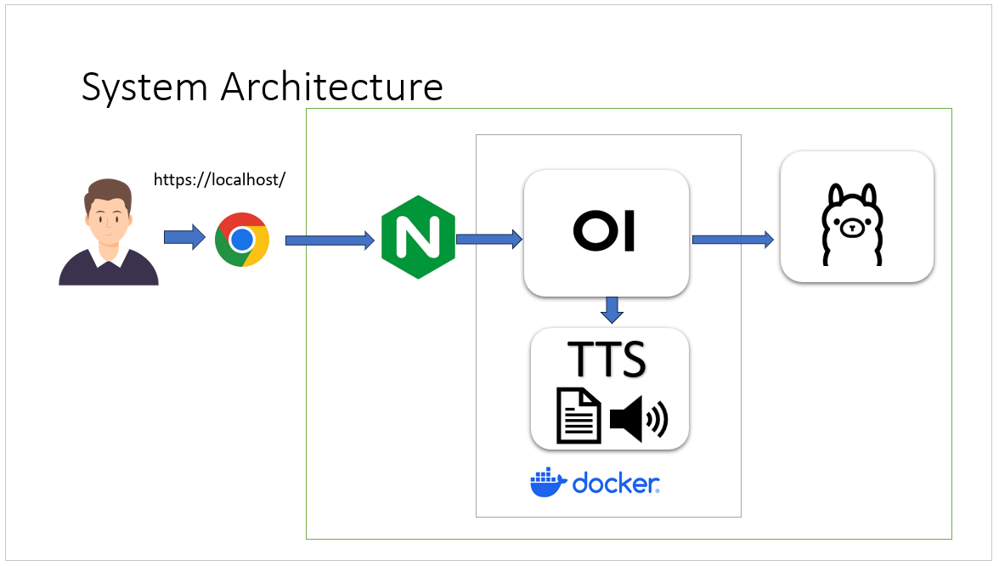

# Step by Step Setup Open Web-UI with Docker on Windows

- open-webui
- openai-edge-tss
- nginx
- generate ssl for https

#### System Architecture

**Step by Step Click Link Below**

1. [Setup Ollama](1.setup_ollama.md)
2. [Setup Docker Desktop](2.setup_docker_desktop.md)
3. [Setup  run docker openai-edge-tts,  docker open-webui](3.setup_openwebui_openai-edge-tts.md)
4. [install nginx](4.install_nginx.md)
5. [generate selfsign cert for localhost](5.generate_selfsign_cert.md)
6. [setup nginx config file](6.setup_nginx_config.md)
7. [Signup and config Open WebUI](7.config_open_webui.md)
8. [using Open WebUI](8.ready_to_using_ai.md)

Using Open Web-UI

