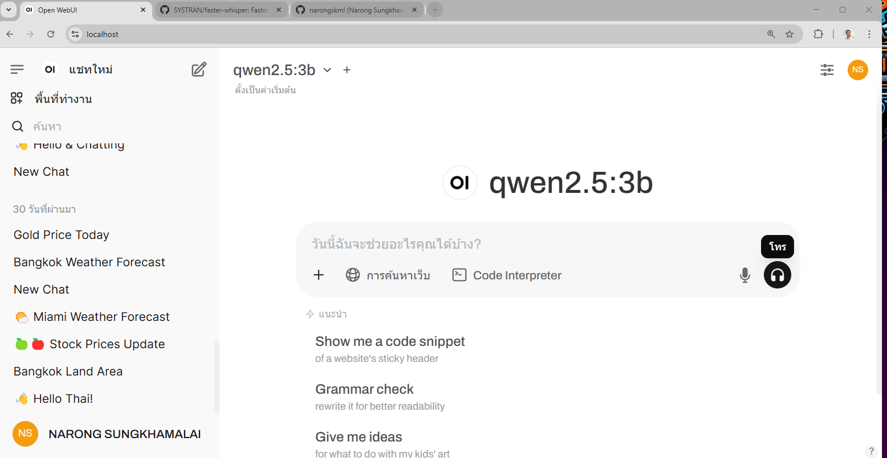
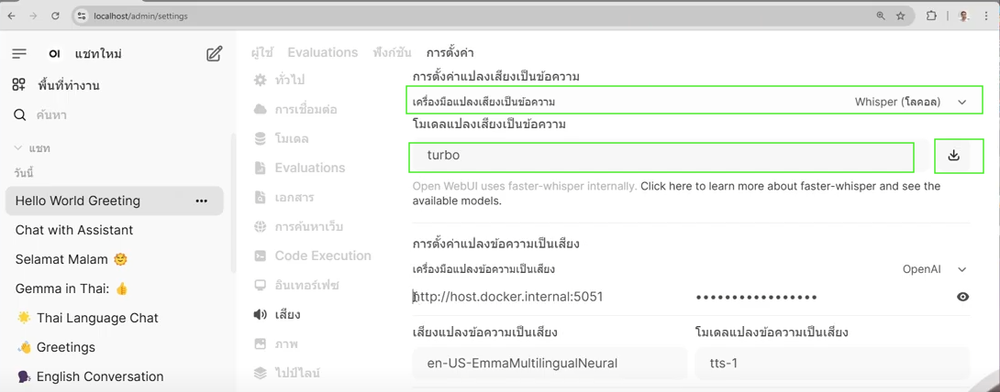
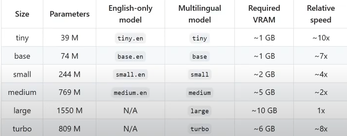

# วิธี การ Config Open Web UI  ให้รับเสียง Speech to Text

    ใน Mode CALL/โทร

วิธีการ Setup 

    ให้เปิดไปที่ Admin Panel  >  Setting >  Audio

    เลือก Whisepr (Local)

    เลือก โมเดล เช่น  small, base, medium, large, turbo  แล้ว แต่ ขนาดของ เครื่องที่จะ Rund

ขนาด Model แปลงเสียงเป็น ข้อความ

เมื่อบันทึกแล้ว สามารถ ใช้ ปุ่ม โทร (Call)  เพื่อคุย กับ AI  ได้ โดยให้เลือก Model ที่รองรับภาษาไทย เช่น QWen 2.5  เป็นต้น กรณี ต้องการคุยเป็นภาษาไทย
